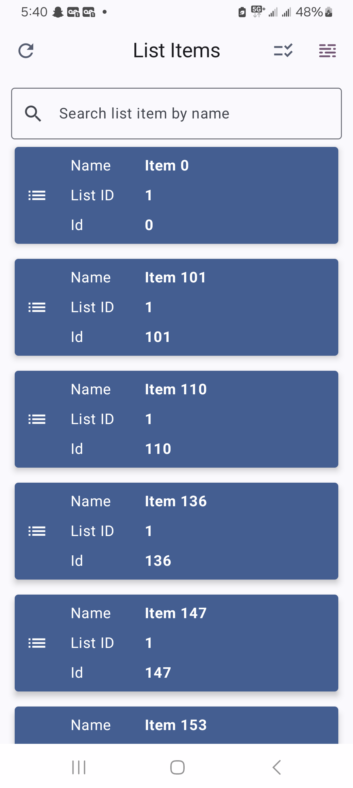
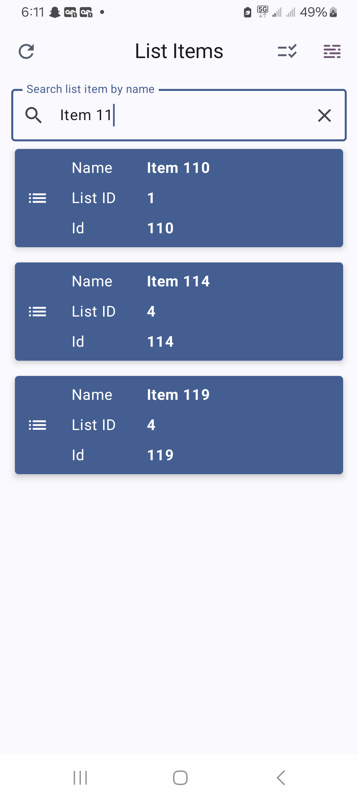
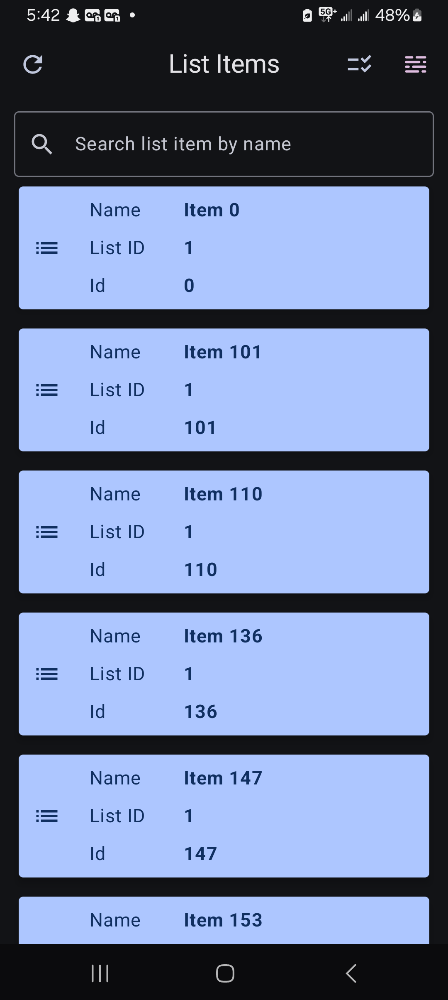
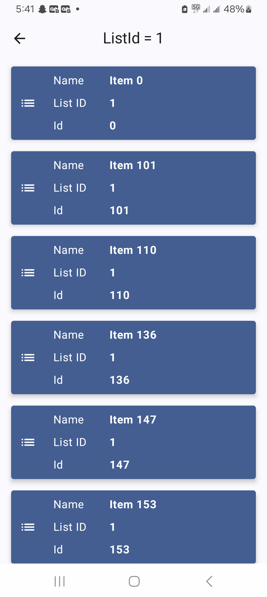
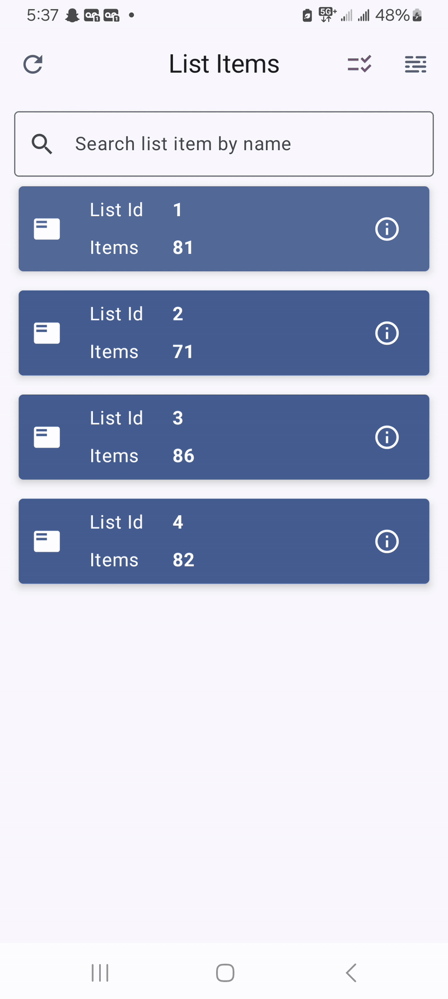

# 📱 Fetch Rewards Android App

This is a Kotlin-based Android application that fetches and displays list items grouped by List ID using MVVM architecture, Retrofit, Room, and Material Design 3. It handles network state gracefully and provides a seamless offline-first user experience.

## 📸 Screenshots

| Home (Light) | Search By Name | Dark Mode                      | Grouped By List ID             |
|--------------|----------------|--------------------------------|--------------------------------|
|  |  |  |  |

## 🎥 Demo
| Home Screen         | Filter                          |
|---------------------|---------------------------------|
|  |  


## 🚀 Features

- 📡 Fetches and stores items from a remote API using Retrofit 
- 🗃️ Caches data locally using Room (offline support)
-     Orders data by ListId attribute first and then sorts by name attribute filters items by name != null or empty
- 🔄 Network-aware refresh icon:
    - If network is available, shows refresh icon
    - If offline, shows no-network icon with status message
    - Lets users know if data is from cache or freshly fetched
- 🔍 Search list items by name
- 🧹 Sort items by name or ID
- 🌓 Material You (M3) Light & Dark themes
- 🧠 MVVM architecture with Coroutines + Flow
- ✅ Dependency Injection via Hilt

## 📦 Tech Stack

- Kotlin
- Retrofit
- Room (SQLite)
- Kotlin Coroutines / Flow
- Hilt (DI)
- Material Design 3
- Jetpack ViewModel + LiveData


## 📲 How it Works

- On launch, the app attempts to fetch data from the network.
- If successful, it stores data in the Room DB.
- If offline, it loads the most recent data from Room.
- Refresh icon is only shown if online.
- User is informed whether data is from cache or freshly fetched.

## 🧭 Navigation Flow

- Home(Filter By Name / Group by List id) -> Show items by list id (Filter applied if search by name is done)

## 🛠️ Build & Run

1. Clone repo
2. Open in Android Studio Arctic Fox+
3. Build & run on device or emulator (min SDK 26) (compileSdk 35) 

minSdk = 26
targetSdk = 35
compileSdk = 35

uses JAVA 1.8 (you can change it to Java 17 by changing below attributes in build.gradle.kts(app))
compileOptions {
sourceCompatibility = JavaVersion.VERSION_1_8
targetCompatibility = JavaVersion.VERSION_1_8
}
kotlinOptions {
jvmTarget = "1.8"
}


## 📂 Project Structure

```plaintext 
com.fetch.rewards.exercise/
│
├── db/                        # Room DB layer
│   ├── ExerciseAppDb.kt       # Database instance
│   ├── ListItem.kt            # Entity
│   └── ListItemDao.kt         # DAO interface
│
├── nav/                       # App navigation
│   ├── ExerciseAppNavHost.kt
│   └── Screen.kt
│
├── network/                   # API + connectivity
│   ├── ListApi.kt
│   ├── ApiResultFailure.kt
│   └── ConnectivityService.kt
│
├── screens/                   # Top-level screens
│   ├── ShowAllScreen.kt
│   └── ShowByIdScreen.kt
│
├── ui.theme/                  # Material3 theming
│   ├── Color.kt
│   ├── Theme.kt
│   └── Type.kt
│
├── views/                     # Reusable UI components
│   ├── ExerciseAppBar.kt
│   ├── NetworkViews.kt
│   ├── SearchView.kt
│   ├── ListGroupCardView.kt
│   ├── ListWithNameCardView.kt
│   ├── ListByIdListView.kt
│   ├── GroupStateIcon.kt
│   ├── ShowAllContainer.kt
│   └── ShowByIdContainer.kt
│
├── ExerciseApp.kt             # Application class
├── ExerciseAppModule.kt       # Hilt dependency injection
├── ListItemRepository.kt      # Repository layer
├── ListItemViewModel.kt       # ViewModel layer
├── MainActivity.kt
└── Result.kt                  # Result wrapper (sealed class)

